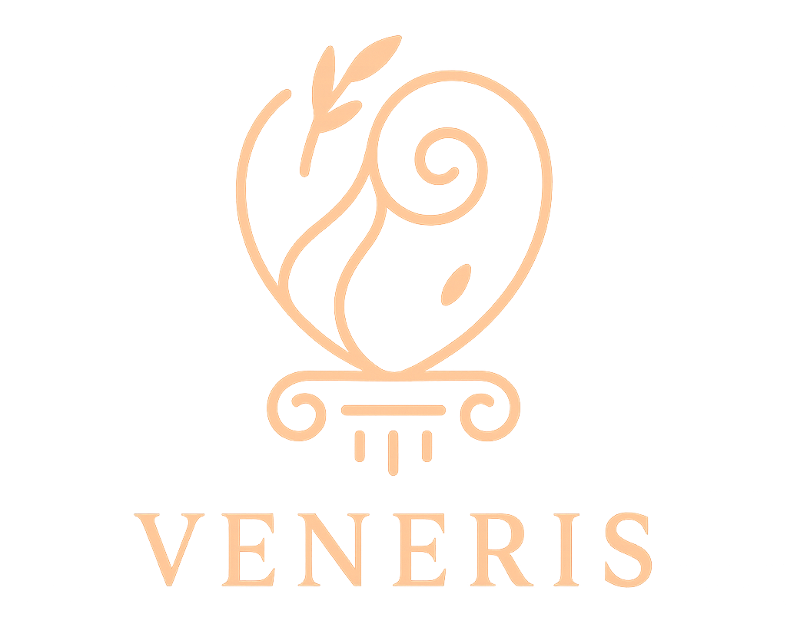

# Veneris



**Veneris** es una aplicación de citas en la que los usuarios pueden entablar conversaciones con otras personas con el fin de conocerse y establecer relaciones amorosos. 
A diferencia de las aplicaciones de citas convenciales, **Veneris** incorpora juegos cooperativos en los que los usuarios interactúan entre sí para comprobar su compatibilidad. 

Al participar en estos juegos, los usuarios pueden ganar puntos con otros, los cuales servirán para **desbloquear la funcionalidad del chat**.
De esta manera, se evitan las interacciones efímeras, y se fomenta la creación de **relaciones más duraderas y reales**.

---

## Vista previa


---

## Objetivo del proyecto

Este proyecto busca proponer una alternativa más **entretenida y significativa** para conocer gente, fomentando la búsqueda de relaciones **auténticas y serias**.

## Ejecutando Veneris localmente

El método para ejecutar la página web desde tu dispositivo es sencillo: 

1. Accede a la carpeta que contiene a la página web.
   
```bash
   carpeta_nombre_local.zip
```

2.Descomprime el archivo ZIP.

```bash
   carpeta_nombre_local.zip → carpeta_nombre_local/
```

3. Abre la carpeta del proyecto y ejecuta el archivo principal en tu navegador.

```bash
   index.html
```

> [!NOTE]
> La aplicación se ejecuta directamente desde un archivo **HTML** local.  
> Asegúrate de mantenerlo en su ubicación original para evitar errores al abrir la web.

## Tests


## Tecnologías utilizadas

- **HTML5** → estructura del contenido  
- **CSS3** → diseño y estilos responsivos  
- **JavaScript (ES6)** → interacción y lógica del juego 

## Contribuidores

Gracias a todas las personas que han participado en el desarrollo de este proyecto:

<a href="https://github.com/UCM-FDI-DISIA/proyectois1-fiesta-cumple/graphs/contributors">
  
</a>

---

## Licencia

NOMBRE se distribuye bajo la licencia **MIT**.  
Puedes usarlo y modificarlo libremente, siempre dando crédito a los autores.


